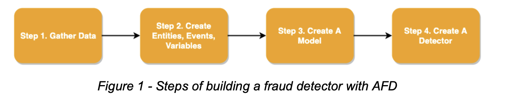
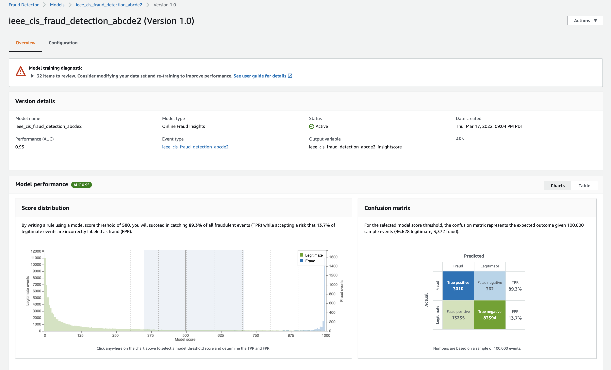

## Steps to reproduce AFD models
Amazon Fraud Detector (AFD) models can be either run via AWS Console or using API calls. In this folder, we provide scripts that make API calls to create model artifacts and then to score the model on test data.

High level steps to train and deploy model are:



You can use provided scripts to replicate performance shown in the benchmark.

1. Setup AWS credentials in terminal for the AWS account where you want to run AFD, and store the data. You can use environment variables as [following](https://docs.aws.amazon.com/cli/latest/userguide/cli-configure-envvars.html)


2. Use the [template data-loader notebook](../../examples/Test_FDB_Loader.ipynb) to upload the benchmark data on S3. (AFD requires data to be saved in S3 and require an S3 path) 


3. Create AFD resources including entities, event types, and model. Update values in `IAM_ROLE`, `BUCKET`, `KEY` and `MODEL_NAME` in the `create_afd_resources.py`, then run following.

```
python create_afd_resources.py configs/{dataset-you-want-to-use}
```

You can keep `MODEL_TYPE` as **ONLINE_FRAUD_INSIGHTS** or **TRANSACTION_FRAUD_INSIGHTS** to run corresponding models.

This will initiate automatic model training. Wait for ~1 hour for models to train. You can check status in your console.

4. Create detector and use it to score on the test data. Update values in `IAM_ROLE`, `BUCKET`, `TEST_PATH`, `TEST_LABELS_PATH` and `MODEL_NAME` in the `score_afd_resources.py`, then run following.

```
python score_afd_model.py
```
This will print performance metrics in terminal as well as save in S3 location you provide in the script.

After a model training is completed, AFD console would show performance metrics like following (trained on `ieeecis` with ONLINE_FRAUD_INSIGHTS).




**In order to fully deep dive into working of Amazon Fraud Detector, [here](https://d1.awsstatic.com/fraud-detector/afd-technical-guide-detecting-new-account-fraud.pdf) is the link to technical guide.**

